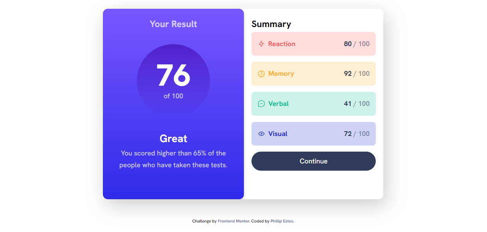

# Frontend Mentor - Results summary component solution

This is a solution to the [Results summary component challenge on Frontend Mentor](https://www.frontendmentor.io/challenges/results-summary-component-CE_K6s0maV). Frontend Mentor challenges help you improve your coding skills by building realistic projects.

## Table of contents

- [Overview](#overview)
  - [The challenge](#the-challenge)
  - [Screenshot](#screenshot)
  - [Links](#links)
- [My process](#my-process)
  - [Built with](#built-with)
  - [What I learned](#what-i-learned)
  - [Continued development](#continued-development)
  - [Useful resources](#useful-resources)
- [Author](#author)

## Overview

### The challenge

Users should be able to:

- View the optimal layout for the interface depending on their device's screen size
- See hover and focus states for all interactive elements on the page

### Screenshot

### Links

- Solution URL: [Add solution URL here](https://your-solution-url.com)
- Live Site URL: [Add live site URL here](https://your-live-site-url.com)

## My process

### Built with

- Semantic HTML5 markup
- CSS custom properties
- Flexbox
- CSS Grid

### What I learned

I learned a lot about positioning, grid-flow, data-spacing, and hsl
To see how you can add code snippets, see below:

### Continued development

I will need to focus on learning more about positioning for my future projects as well as mastering css grid

### Useful resources

- [resource 1](https://developer.mozilla.org/en-US/docs/Web/CSS/color_value/hsl) - The following resources helped me understand hsl. before doing this challenge i had no idea what it was and was a little intimidated at first. after doing some research and becoming a little more comfortable with them i may utilize hsl in future projects. I also received help from some youtube videos when i got stuck on some topics.
- [resource 2](https://www.w3schools.com/colors/colors_hsl.asp).

## Author

- Website - [Phillip](https://personal-site-puce-three.vercel.app/)
- Frontend Mentor - [@Repo1206](https://www.frontendmentor.io/profile/Repo1206)
- Twitter - [@Phillip_Estes20](https://twitter.com/Phillip_Estes20)
